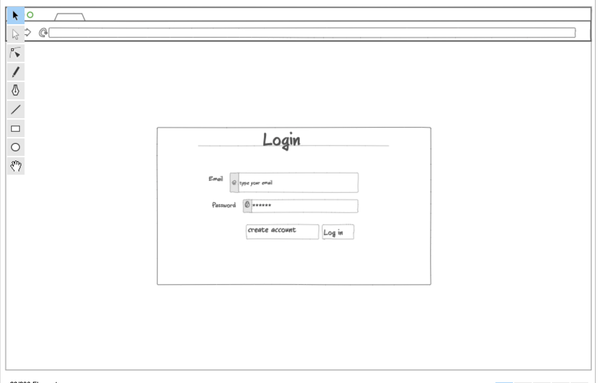
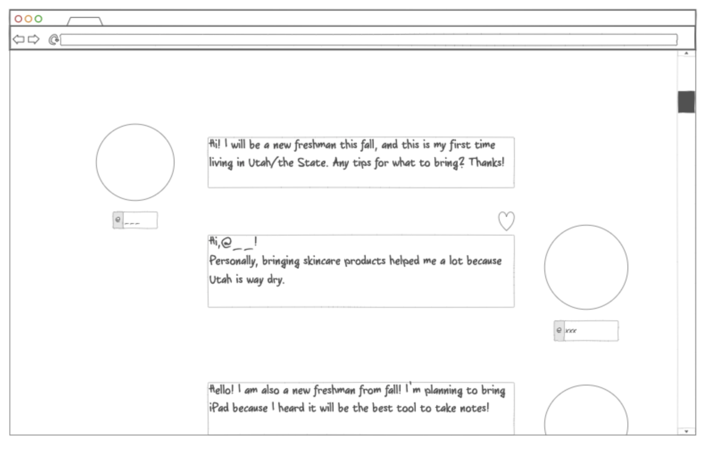

# startup

**How to secure a webpage** 

    When you have a not secure from the location var:

    request HTTPS -> Caddy -> Let's Encrypt -> secured!

    1. SSH to WSA from my terminal

    2. Type below on your terminal 
	    cd ~
	    sudo vi Caddyfile

    3. type ‘I” to edit and Change three parts 
	    :80 -> askcougars.click
	    startup.yourdomain -> startup.askcougars.click
	    simon.yourdomain -> simon.askcougars.click

    4. Type esc on your keyboard to finish editing, type :wq to save and quit

    5. Type below so that changes can effect
	    sudo service caddy restart

    6. Secured! Check your webpage’s location bar!

    *The secure version of HTTP is called Secure Hypertext Transport Protocol (HTTPS)

    Below would help to see the negotiations and make sure https://byu.edu has valid certificate.
    curl -v -s https://byu.edu > /dev/null

**How to make deployFiles.sh script work** 

    Type line below on your terminal so that it will 

        1)deletes any previous deployment for simon, 

        2)copies up all of the files found in the project directory,
        
        3)makes sure Caddy is hosting the files under the simon subdomain of your domain (e.g. simon.yourdomain.click).

    ./deployFiles.sh -k ~/keys/production.pem -h yourdomain.click -s simon

# Ask Cougars

## Design

This fall, I will be a new freshman at BYU! But, there are lots that I don’t know and worry about. How can I study effectively? Which classes should I take in the first semester? Where can I go shopping for groceries? ..etc. 

**“Ask Cougars”** provides connections between you and other students at BYU to ask any questions regarding school life so that you will be well prepared. You can also ask cougars where are the best places to go on dates or ideas for proposing to loved ones! Questions can be yours.

## Key features
    -Creating accounts and logging in

    -Ability to type the question to ask

    -Display of questions and comments from others

    -Questions and comments are persistently stored

    -Ability to delete and edit your questions or comments

    -Liked from all users displayed in real-time

    -Ability for admin to delete any inappropriate questions or comments 

    -Display the date questions and comments were posted

